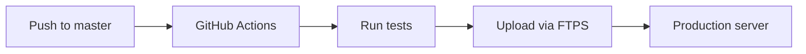
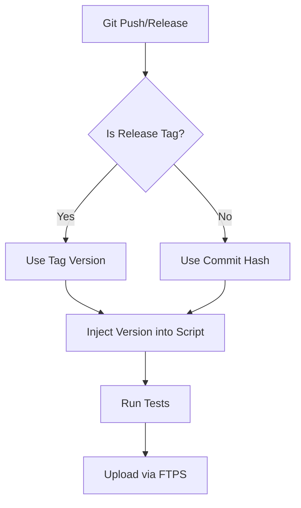

# Versioning Fix Architecture Plan

## Problem Analysis

### Current Implementation
The current versioning mechanism in [`ipregion.sh`](ipregion.sh:5) uses file modification time:

```bash
SCRIPT_VERSION=$(stat -c "%y" "$0" 2>/dev/null | cut -d'.' -f1 || stat -f "%Sm" "$0" 2>/dev/null || echo "unknown")
```

### Issues
1. **Non-deterministic**: File modification date changes on every download, copy, or transfer
2. **Not reproducible**: Same code can have different "versions"
3. **No traceability**: Cannot trace a specific version to a git commit
4. **User confusion**: Users see different version strings for identical functionality

### Current Deployment Flow


## Proposed Solution: Hybrid Versioning System

### Architecture Overview
Implement a hybrid versioning approach that combines:
- **Development builds**: Git commit hash + commit date
- **Release builds**: Semantic version tag (v1.2.3) + commit hash

### Version Format
```
Development: 1a2b3c4d (2025-01-15 10:30 UTC)
Release:     v2.1.0 (1a2b3c4d)
```

### New Architecture Flow


## Implementation Details

### 1. Script Changes (ipregion.sh)

#### Change 1: Replace version variable
**Location**: Line 5

**Current:**
```bash
SCRIPT_VERSION=$(stat -c "%y" "$0" 2>/dev/null | cut -d'.' -f1 || stat -f "%Sm" "$0" 2>/dev/null || echo "unknown")
```

**New:**
```bash
# Version metadata - injected during build/deploy
# Format: VERSION_TYPE|VERSION_VALUE|BUILD_DATE|COMMIT_HASH
# Examples:
#   tag|v2.1.0|2025-01-15T10:30:00Z|1a2b3c4d
#   commit|1a2b3c4d|2025-01-15T10:30:00Z|
SCRIPT_VERSION_METADATA="unknown|unknown|unknown|"
```

#### Change 2: Add version parsing function
**Location**: After existing utility functions (~line 463)

```bash
# Parse version metadata and return formatted version string
get_script_version() {
  IFS='|' read -r version_type version_value build_date commit_hash <<<"$SCRIPT_VERSION_METADATA"

  case "$version_type" in
    tag)
      # Release build: v2.1.0 (1a2b3c4d)
      if [[ -n "$commit_hash" ]]; then
        echo "${version_value} (${commit_hash})"
      else
        echo "$version_value"
      fi
      ;;
    commit)
      # Development build: 1a2b3c4d (2025-01-15 10:30 UTC)
      if [[ -n "$build_date" ]]; then
        local formatted_date=$(echo "$build_date" | sed 's/T/ /; s/Z/ UTC/')
        echo "${version_value} (${formatted_date})"
      else
        echo "$version_value"
      fi
      ;;
    *)
      # Fallback for unknown version
      echo "unknown"
      ;;
  esac
}
```

#### Change 3: Update version display
**Location**: Lines 350-353

**Current:**
```bash
printf "%s %s: %s\n" \
  "$(color INFO '[INFO]')" \
  "$(color HEADER 'Version')" \
  "$SCRIPT_VERSION" >&2
```

**New:**
```bash
printf "%s %s: %s\n" \
  "$(color INFO '[INFO]')" \
  "$(color HEADER 'Version')" \
  "$(get_script_version)" >&2
```

### 2. GitHub Actions Workflow Changes

#### Create new workflow: `.github/workflows/deploy-with-version.yml`

```yaml
name: Deploy with Version Injection

on:
  push:
    branches:
      - master
    paths:
      - ipregion.sh
      - index.php
  release:
    types: [published]
  workflow_dispatch:

jobs:
  deploy:
    runs-on: ubuntu-latest
    steps:
      - name: Checkout
        uses: actions/checkout@v4
        with:
          fetch-depth: 0  # Full history for tags

      - name: Install dependencies
        run: sudo apt-get update && sudo apt-get install -y jq lftp

      - name: Extract version metadata
        id: version
        run: |
          # Check if this is a release build
          if [[ "${{ github.event_name }}" == "release" ]]; then
            VERSION_TYPE="tag"
            VERSION_VALUE="${{ github.event.release.tag_name }}"
            COMMIT_HASH="${GITHUB_SHA:0:8}"
          else
            VERSION_TYPE="commit"
            VERSION_VALUE="${GITHUB_SHA:0:8}"
            COMMIT_HASH=""
          fi

          # Get commit date in ISO 8601 format
          BUILD_DATE=$(git log -1 --format=%cI HEAD)

          # Create version metadata string
          VERSION_METADATA="${VERSION_TYPE}|${VERSION_VALUE}|${BUILD_DATE}|${COMMIT_HASH}"

          echo "version_type=${VERSION_TYPE}" >> $GITHUB_OUTPUT
          echo "version_value=${VERSION_VALUE}" >> $GITHUB_OUTPUT
          echo "build_date=${BUILD_DATE}" >> $GITHUB_OUTPUT
          echo "commit_hash=${COMMIT_HASH}" >> $GITHUB_OUTPUT
          echo "version_metadata=${VERSION_METADATA}" >> $GITHUB_OUTPUT

          echo "Version metadata: ${VERSION_METADATA}"

      - name: Inject version into script
        run: |
          # Create a temporary copy with version injected
          sed -i "s|^SCRIPT_VERSION_METADATA=.*|SCRIPT_VERSION_METADATA=\"${{ steps.version.outputs.version_metadata }}\"|" ipregion.sh

          # Verify injection
          echo "Injected version line:"
          grep "^SCRIPT_VERSION_METADATA=" ipregion.sh

      - name: Run tests
        run: bash tests/run.sh

      - name: Upload files via FTPS
        env:
          FTP_HOST: ${{ secrets.FTP_HOST }}
          FTP_USER: ${{ secrets.FTP_USER }}
          FTP_PASS: ${{ secrets.FTP_PASS }}
          FTP_CA_PEM: ${{ secrets.FTP_CA_PEM }}
        run: |
          echo "$FTP_CA_PEM" > /tmp/ftps-ca.pem
          lftp -e "set ftp:ssl-force true; set ftp:ssl-protect-data true; set ssl:verify-certificate yes; set ssl:ca-file /tmp/ftps-ca.pem; set ftp:passive-mode true; set net:timeout 20; set net:max-retries 2; set net:reconnect-interval-base 5; set net:reconnect-interval-max 5; set cmd:fail-exit true; pwd; ls; put -O / ipregion.sh -o ipregion.sh.tmp; mv /ipregion.sh.tmp /ipregion.sh; put -O / index.php -o index.php.tmp; mv /index.php.tmp /index.php; bye" \
            "ftp://$FTP_USER:$FTP_PASS@$FTP_HOST" || \
          lftp -e "set ftp:ssl-force true; set ftp:ssl-protect-data true; set ssl:verify-certificate yes; set ssl:ca-file /tmp/ftps-ca.pem; set ftp:passive-mode true; set net:timeout 20; set net:max-retries 2; set net:reconnect-interval-base 5; set net:reconnect-interval-max 5; set cmd:fail-exit true; pwd; ls; put -O / ipregion.sh; put -O / index.php; bye" \
            "ftp://$FTP_USER:$FTP_PASS@$FTP_HOST"
```

### 3. Alternative: Build Script Approach

If you prefer to keep the workflow simpler, create a build script:

#### Create: `scripts/build.sh`

```bash
#!/usr/bin/env bash
set -euo pipefail

# Build script for ipregion.sh
# Injects version metadata into the script

SCRIPT_PATH="ipregion.sh"
OUTPUT_PATH="${1:-ipregion.sh}"

# Detect version type
if [[ -n "${GITHUB_REF:-}" ]] && [[ "$GITHUB_REF" == refs/tags/* ]]; then
  VERSION_TYPE="tag"
  VERSION_VALUE="${GITHUB_REF#refs/tags/}"
  COMMIT_HASH="${GITHUB_SHA:0:8}"
elif [[ -n "${1:-}" ]] && [[ "$1" == "--tag" ]]; then
  VERSION_TYPE="tag"
  VERSION_VALUE="${2:-}"
  COMMIT_HASH=$(git rev-parse --short HEAD)
else
  VERSION_TYPE="commit"
  VERSION_VALUE=$(git rev-parse --short HEAD)
  COMMIT_HASH=""
fi

# Get commit date
BUILD_DATE=$(git log -1 --format=%cI HEAD)

# Create version metadata
VERSION_METADATA="${VERSION_TYPE}|${VERSION_VALUE}|${BUILD_DATE}|${COMMIT_HASH}"

echo "Building $SCRIPT_PATH with version metadata:"
echo "  Type: $VERSION_TYPE"
echo "  Value: $VERSION_VALUE"
echo "  Date: $BUILD_DATE"
echo "  Commit: ${COMMIT_HASH:-N/A}"

# Inject version
if [[ "$OUTPUT_PATH" == "$SCRIPT_PATH" ]]; then
  # In-place modification
  sed -i "s|^SCRIPT_VERSION_METADATA=.*|SCRIPT_VERSION_METADATA=\"${VERSION_METADATA}\"|" "$SCRIPT_PATH"
else
  # Create new file
  sed "s|^SCRIPT_VERSION_METADATA=.*|SCRIPT_VERSION_METADATA=\"${VERSION_METADATA}\"|" "$SCRIPT_PATH" > "$OUTPUT_PATH"
fi

echo "Build complete: $OUTPUT_PATH"
```

#### Usage examples:
```bash
# Development build (from current commit)
./scripts/build.sh

# Release build with tag
./scripts/build.sh --tag v2.1.0

# Build to separate file
./scripts/build.sh ipregion-built.sh
```

## Version Comparison and Display

### Adding --version flag
Add to the help/argument parsing section:

```bash
case $1 in
  -h | --help)
    display_help
    ;;
  --version)
    echo "ipregion.sh $(get_script_version)"
    echo "Repository: $SCRIPT_URL"
    exit 0
    ;;
  ...
esac
```

### Version display format examples:

**Development build:**
```
[INFO] Version: 1a2b3c4d (2025-01-15 10:30 UTC)
```

**Release build:**
```
[INFO] Version: v2.1.0 (1a2b3c4d)
```

## Migration Strategy

### Phase 1: Preparation
1. Update [`ipregion.sh`](ipregion.sh) with new version variables and parsing function
2. Test locally with manual version injection
3. Ensure backward compatibility (fallback to "unknown")

### Phase 2: Deployment
1. Create new workflow or update existing one
2. Test in a staging environment first
3. Deploy to production

### Phase 3: Release Process
1. Create git tags for releases: `git tag v2.1.0`
2. Push tags: `git push origin v2.1.0`
3. Create GitHub release (triggers release workflow)
4. Version automatically reflects tag name

## Benefits

1. **Deterministic**: Same commit = same version string
2. **Traceable**: Can trace any version back to exact git commit
3. **User-friendly**: Releases show semantic version (v2.1.0)
4. **Debuggable**: Development builds show commit hash and date
5. **Automated**: No manual version updates needed
6. **Standard-compliant**: Follows semantic versioning best practices

## Alternative Approaches Considered

### 1. Static version file
- **Pros**: Simple, no build step
- **Cons**: Manual updates required, easy to forget

### 2. Git describe
- **Pros**: Automatic, includes distance from tag
- **Cons**: Requires git history in deployed file, complex parsing

### 3. Build timestamp only
- **Pros**: Simple
- **Cons**: Same problem as current (non-deterministic)

### 4. External version API
- **Pros**: Centralized control
- **Cons**: Requires network, single point of failure

**Selected approach** (hybrid git-based) provides the best balance of automation, traceability, and user-friendliness.

## Testing Checklist

- [ ] Version metadata correctly injected during build
- [ ] Development builds show commit hash and date
- [ ] Release builds show tag name and commit hash
- [ ] Version display works in both normal and JSON output modes
- [ ] --version flag works correctly
- [ ] Backward compatibility when version metadata is missing
- [ ] GitHub Actions workflow passes tests
- [ ] Deployed script has correct version
